<!--
Rapport de stage — Cadence (Devox)
Document de travail au format Markdown (fichier unique).
Diagrammes en blocs Mermaid (rendus par GitHub / VS Code ; exportables en image).
Les captures d'écran sont à insérer manuellement aux emplacements [Figure N : …].
Conversion vers Word/PDF possible via Pandoc.
-->

# Cadence — Application de pilotage de projets agiles intégrant la capacité réelle de l'équipe

---

## Page de couverture

> **Établissement** : _[Nom de l'établissement / Faculté]_
> **Filière** : Licence — _[intitulé de la filière, ex. Génie Informatique / Développement Web]_
> **Année universitaire** : 2025 – 2026

**Rapport de stage de fin de cycle**

# CADENCE
### Application web de pilotage de projets agiles intégrant la capacité réelle de l'équipe

**Réalisé par :** Reda B.

**Organisme d'accueil :** Devox — Témara

**Encadrant entreprise :** _[Nom, fonction]_
**Encadrant pédagogique :** _[Nom, fonction]_

**Période de stage :** _[date début] – [date fin] 2026_

---

## Dédicace

_[Espace réservé — quelques lignes personnelles : à compléter par l'auteur.]_

---

## Remerciements

Je tiens à exprimer ma gratitude à l'ensemble de l'équipe de **Devox** pour son accueil et son
accompagnement tout au long de ce stage. Mes remerciements s'adressent en particulier à mon
**encadrant en entreprise**, _[nom]_, pour sa disponibilité, ses conseils techniques et la
confiance accordée sur un projet à forte composante métier.

Je remercie également mon **encadrant pédagogique**, _[nom]_, ainsi que le corps enseignant de
_[établissement]_, pour le cadre de formation qui a rendu ce travail possible.

Enfin, je remercie ma famille et mes proches pour leur soutien constant.

---

## Résumé

**Cadence** est une application web de pilotage de projets agiles développée durant un stage chez
Devox (Témara). Elle réunit en un seul produit la gestion de projets, de sprints et d'un tableau
Kanban, et la gestion de la disponibilité de l'équipe (congés, jours travaillés). Sa spécificité
est de **dériver la capacité d'un sprint des disponibilités réelles** des membres — jours
travaillés moins congés validés, multipliés par la capacité quotidienne — puis de la comparer à la
charge engagée des tâches planifiées, avec une **alerte de surcharge**. Le produit a été réalisé
avec une API REST Node.js/Express adossée à MongoDB et un front React/Vite. Ce rapport présente le
contexte, l'analyse des besoins, la conception (architecture, modèle de données, algorithme de
capacité) et la réalisation de l'application.

**Mots-clés :** méthodes agiles, Scrum, tableau Kanban, planification de capacité, disponibilité
d'équipe, React, Node.js, Express, MongoDB, API REST, JWT.

## Abstract

**Cadence** is a web application for agile project management built during an internship at Devox
(Témara, Morocco). It unifies project, sprint and Kanban-board management with team-availability
management (leaves, working days). Its distinctive feature is to **derive a sprint's capacity from
the team's real availability** — working days minus approved leaves, multiplied by daily capacity —
and to compare it with the committed workload of planned tasks, raising an **overload alert**. The
product was built with a Node.js/Express REST API backed by MongoDB and a React/Vite front end.
This report covers the context, requirements analysis, design (architecture, data model, capacity
algorithm) and implementation of the application.

**Keywords:** agile methods, Scrum, Kanban board, capacity planning, team availability, React,
Node.js, Express, MongoDB, REST API, JWT.

---

## Sommaire

1. [Introduction générale](#introduction-générale)
2. [Chapitre 1 — Contexte général du projet](#chapitre-1--contexte-général-du-projet)
3. [Chapitre 2 — Analyse et spécification des besoins](#chapitre-2--analyse-et-spécification-des-besoins)
4. [Chapitre 3 — Conception](#chapitre-3--conception)
5. [Chapitre 4 — Réalisation et mise en œuvre](#chapitre-4--réalisation-et-mise-en-œuvre)
6. [Conclusion générale et perspectives](#conclusion-générale-et-perspectives)
7. [Bibliographie / Webographie](#bibliographie--webographie)
8. [Annexes](#annexes)

---

## Liste des figures

- Figure 1.1 — Positionnement de Cadence (benchmark)
- Figure 1.2 — Planning prévisionnel du stage (Gantt)
- Figure 2.1 — Diagramme de cas d'utilisation
- Figure 2.2 — Diagramme de séquence : calcul de la capacité d'un sprint
- Figure 2.3 — Cycle de vie d'un sprint (diagramme d'états)
- Figure 3.1 — Architecture générale (3 tiers)
- Figure 3.2 — Pipeline de traitement d'une requête
- Figure 3.3 — Modèle de données (diagramme entité-association)
- Figure 3.4 — Logigramme de l'algorithme de capacité
- Figure 4.1 — Écran de connexion
- Figure 4.2 — Tableau Kanban (sprint actif)
- Figure 4.3 — Planification & barre de capacité
- Figure 4.4 — Congés & calendrier d'équipe (disponibilité + validation)
- Figure 4.5 — Tableau de bord
- Figure 4.6 — Équipe du projet (capacité & temps réalisé)

## Liste des tableaux

- Tableau 2.1 — Rôles et permissions
- Tableau 2.2 — Besoins fonctionnels par module
- Tableau 3.1 — Choix techniques (besoin → technologie → justification)
- Tableau 4.1 — Principaux points d'accès de l'API

## Glossaire / Abréviations

| Terme | Définition |
|---|---|
| **Agile** | Famille de méthodes itératives et incrémentales de gestion de projet. |
| **Scrum** | Cadre agile organisant le travail en *sprints* avec des rôles et rituels définis. |
| **Sprint** | Itération de durée fixe au terme de laquelle un incrément de produit est livré. |
| **Backlog** | Liste priorisée des tâches non encore planifiées dans un sprint. |
| **Kanban** | Tableau visuel organisant les tâches en colonnes par état d'avancement. |
| **Capacité** | Volume de travail (en heures) qu'une équipe peut réellement absorber sur un sprint. |
| **Charge engagée** | Somme des estimations des tâches planifiées dans un sprint. |
| **Surcharge** | Situation où la charge engagée dépasse la capacité disponible. |
| **API REST** | Interface de programmation suivant le style architectural REST (HTTP, ressources). |
| **JWT** | *JSON Web Token* — jeton signé portant l'identité de l'utilisateur authentifié. |
| **RBAC** | *Role-Based Access Control* — contrôle d'accès fondé sur les rôles et permissions. |
| **ODM** | *Object-Document Mapper* (Mongoose) — couche d'accès aux documents MongoDB. |
| **MVP** | *Minimum Viable Product* — version minimale viable d'un produit. |

---

# Introduction générale

La gestion de projets en informatique s'appuie aujourd'hui largement sur les **méthodes agiles**,
qui organisent le travail en itérations courtes appelées *sprints*. À chaque sprint, l'équipe
s'engage sur un ensemble de tâches qu'elle estime pouvoir réaliser. La qualité de cet engagement
dépend d'une question simple mais souvent mal traitée : **de combien de temps l'équipe
dispose-t-elle réellement** sur la période ?

En pratique, les outils répandus (Jira, Trello, ClickUp) raisonnent surtout en *points* ou en
nombre de tâches, sans relier la planification aux **absences réelles** des membres (congés,
maladie, jours non travaillés). Une équipe peut ainsi s'engager sur une charge théoriquement
tenable, mais irréaliste une fois soustraits les jours d'indisponibilité — d'où des
**sur-engagements**, des retards et une démobilisation.

C'est à ce problème que répond **Cadence**, l'application développée durant ce stage chez **Devox**
(Témara). Cadence réunit la gestion de projets agiles (projets, sprints, tableau Kanban) et la
gestion de la disponibilité de l'équipe (congés, jours travaillés), et surtout **dérive la capacité
d'un sprint des disponibilités réellement constatées** : jours travaillés moins congés validés,
multipliés par la capacité quotidienne de chaque membre. Cette capacité est comparée à la charge
engagée des tâches, et une **alerte de surcharge** prévient l'équipe avant l'engagement.

L'objectif du stage était de concevoir et réaliser cette application, du modèle de données à
l'interface utilisateur, en respectant des règles métier précises et des exigences de sécurité.

Ce rapport est organisé en quatre chapitres. Le **chapitre 1** présente l'organisme d'accueil, le
contexte et la problématique. Le **chapitre 2** détaille l'analyse et la spécification des besoins.
Le **chapitre 3** expose la conception (architecture, modèle de données et algorithme de capacité).
Le **chapitre 4** décrit la réalisation et les choix de mise en œuvre. Une conclusion dresse le
bilan et ouvre des perspectives.

---

# Chapitre 1 — Contexte général du projet

## 1.1 Organisme d'accueil

Le stage s'est déroulé au sein de **Devox**, société de développement informatique située à
**Témara**. Devox conçoit et réalise des solutions logicielles (applications web et mobiles) pour
ses clients, en s'appuyant sur des pratiques de développement modernes (intégration de versions via
Git, méthodes agiles, revues de code).

_[À compléter par l'auteur : taille de l'équipe, organisation interne, secteurs d'activité,
technologies privilégiées, place du stagiaire dans l'organigramme.]_

L'environnement de travail, à la fois technique et collaboratif, a constitué un cadre propice à la
réalisation d'un projet complet, de l'analyse du besoin jusqu'à la mise en œuvre.

## 1.2 Cadre et problématique

Les équipes de développement planifient leur travail par itérations. Au début de chaque sprint,
elles décident des tâches à embarquer. Or **l'estimation de ce qui est réalisable** dépend du temps
réellement disponible, lequel varie selon :

- les **jours travaillés** propres à chaque membre (temps plein, temps partiel) ;
- les **congés et absences** (vacances, maladie) qui retirent des jours sur la période.

Les outils du marché modélisent rarement ce lien. La capacité y est exprimée en points de complexité
ou en nombre de tâches, déconnectée des absences. La conséquence est un **risque de sur-engagement** :
l'équipe planifie plus qu'elle ne peut livrer.

**Problématique.** _Comment outiller une équipe agile pour qu'elle planifie ses sprints en fonction
de sa disponibilité réelle, et soit alertée automatiquement en cas de surcharge ?_

**Hors-périmètre.** Cadence ne comporte **aucune logique financière** (pas de salaire, pas de coût
horaire, pas de facturation). Le produit raisonne exclusivement en **heures** et en **jours** de
disponibilité.

## 1.3 Objectifs du projet

L'objectif est de réaliser un **MVP** (produit minimum viable) comprenant une API REST et un front
web, couvrant :

1. la gestion des **projets** et de leurs **membres** ;
2. la gestion des **sprints** et de leur cycle de vie ;
3. un **tableau Kanban** avec glisser-déposer et un **backlog** ;
4. la gestion des **congés** et un **calendrier d'équipe** ;
5. la **fonctionnalité signature** : calcul de la **capacité disponible** d'un sprint comparée à la
   **charge engagée**, avec **alerte de surcharge** ;
6. un **tableau de bord** d'avancement et de charge par membre.

La fonctionnalité de capacité constitue le cœur du produit et ne doit jamais être traitée comme
secondaire.

## 1.4 Étude de l'existant (benchmark)

| Outil | Forces | Limite vis-à-vis du besoin |
|---|---|---|
| **Jira** | Très complet, workflows agiles avancés. | Lourd ; capacité non dérivée des absences réelles. |
| **Trello** | Simple, Kanban intuitif. | Pas de notion de sprint ni de capacité d'équipe. |
| **ClickUp** | Polyvalent, nombreuses vues. | Capacité orientée charge, peu liée aux congés validés. |

**Positionnement de Cadence.** Cadence se distingue en faisant de la **disponibilité réelle** le
pivot de la planification : les congés validés réduisent automatiquement la capacité du sprint, et
la comparaison capacité/charge déclenche une alerte. C'est cette intégration native qui constitue
sa valeur ajoutée.

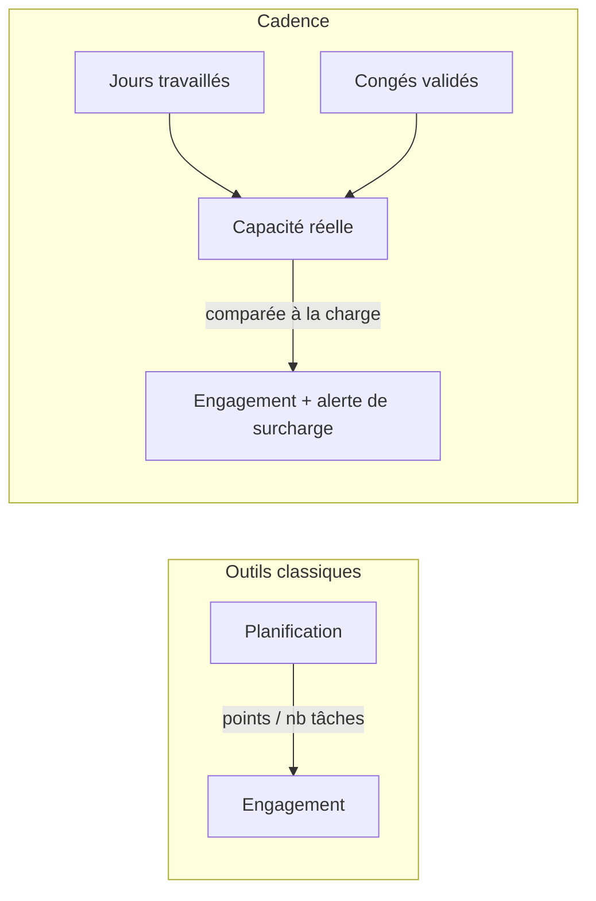
*Figure 1.1 — Positionnement de Cadence : la capacité dérive de la disponibilité réelle.*

## 1.5 Méthodologie de travail

Le projet a été conduit selon une **démarche agile et itérative**. Le travail a été découpé en
phases livrant à chaque fois un incrément fonctionnel (d'abord le socle d'authentification et le
modèle de données, puis les tâches et le Kanban, puis la capacité, enfin les écrans transverses).

Les pratiques suivantes ont été appliquées :

- **gestion de versions** avec Git (commits réguliers, historique lisible) ;
- **revues** et tests manuels de chaque incrément via un jeu de données de démonstration (*seed*) ;
- **tests automatisés** sur la partie la plus sensible (le service de capacité) ;
- points d'avancement réguliers avec l'encadrant.

Le vocabulaire Scrum/Kanban (sprint, backlog, tableau, colonnes d'état) structure à la fois le
**produit** réalisé et la **manière** dont le stage a été mené.

## 1.6 Planning prévisionnel

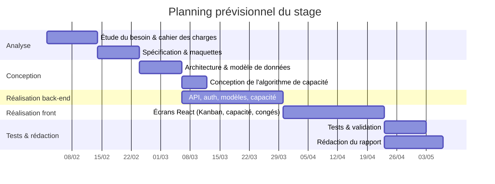
*Figure 1.2 — Planning prévisionnel du stage (les dates sont indicatives et à ajuster).*

---

# Chapitre 2 — Analyse et spécification des besoins

## 2.1 Acteurs et rôles

Cadence distingue trois rôles métier. Le contrôle d'accès est implémenté sous forme de **RBAC
dynamique** : chaque rôle accorde un sous-ensemble d'un **catalogue fixe de permissions**, et trois
**rôles système** (non supprimables) sont fournis par défaut.

| Rôle | Description | Permissions principales |
|---|---|---|
| **developer** | Membre d'équipe : consulte ses projets, met à jour ses tâches, déclare ses congés. | *(aucune permission de gestion ; agit sur ses tâches assignées)* |
| **manager** | Pilote les projets : sprints, planification, validation des congés, tableau de bord. | `project.manage`, `sprint.manage`, `task.manage.any`, `leave.review`, `user.view`, `activity.view`, `status.manage` |
| **admin** | Administre l'application : comptes, paramètres de capacité, rôles. | **toutes** les permissions |

*Tableau 2.1 — Rôles et permissions (cf. `config/permissions.js`).*

Le catalogue de permissions comprend notamment : `project.manage`, `project.manage.any`,
`sprint.manage`, `task.manage.any`, `leave.review`, `user.view`, `user.manage`, `role.manage`,
`activity.view`, `status.manage`. Ce modèle dynamique permet de créer des rôles personnalisés sans
modifier le code.

## 2.2 Besoins fonctionnels

| Module | Besoins |
|---|---|
| **Authentification** | Inscription (rôle *developer* par défaut), connexion par JWT, profil courant. |
| **Projets & membres** | Créer/éditer un projet, gérer ses membres, statut *active/archived*. |
| **Sprints** | Créer un sprint, le démarrer, le clôturer ; cycle `planned → active → completed` ; **un seul actif** par projet. |
| **Tâches & Kanban** | CRUD de tâches, glisser-déposer entre colonnes (changement de statut), réordonnancement persistant, commentaires, pièces jointes, suivi du temps. |
| **Backlog** | Lister/gérer les tâches sans sprint (`sprint: null`), les rattacher à un sprint. |
| **Capacité** | Calculer la capacité disponible d'un sprint vs la charge engagée, avec détail des absences et alerte de surcharge. |
| **Congés & calendrier** | Déclarer un congé, le valider/refuser (manager), visualiser la disponibilité de l'équipe. |
| **Tableau de bord** | Avancement du sprint, tâches par statut, charge et taux d'occupation par membre. |
| **Notifications & activité** | Notifications (congé, affectation, démarrage de sprint) et journal d'audit. |

*Tableau 2.2 — Besoins fonctionnels par module.*

## 2.3 Besoins non fonctionnels

- **Sécurité** : authentification JWT, mots de passe hachés (bcrypt, champ `passwordHash` en
  `select: false`), validation systématique des entrées (express-validator), autorisations par
  rôle/permission sur chaque route protégée.
- **Fiabilité du calcul métier** : le calcul de capacité doit être exact (gestion des fuseaux,
  dédoublonnage des congés) et testé automatiquement.
- **Ergonomie** : interface claire, sobre, cohérente ; retours visuels immédiats (glisser-déposer,
  alerte de surcharge).
- **Responsive** : utilisable sur différentes tailles d'écran.
- **Performance** : pagination côté serveur, mise en cache des requêtes côté client.
- **Maintenabilité** : code structuré par couches, conventions homogènes, gestion d'erreurs
  centralisée.
- **Temps réel** : synchronisation des changements (tableau, notifications) via Socket.io.

## 2.4 Modélisation UML

### 2.4.1 Diagramme de cas d'utilisation

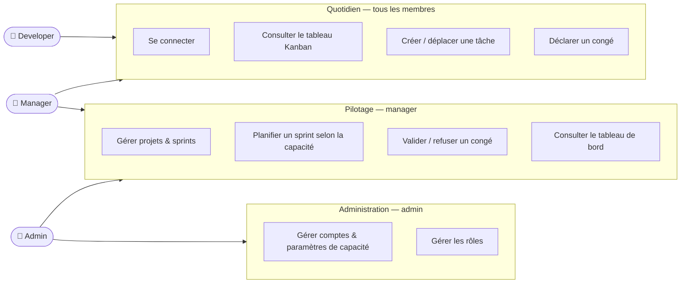
*Figure 2.1 — Diagramme de cas d'utilisation (le manager hérite des cas du developer ; l'admin
ajoute l'administration).*

### 2.4.2 Scénarios principaux

- **Déplacer une tâche** : un membre glisse une carte d'une colonne à une autre ⇒ le statut et
  l'ordre sont mis à jour et persistés.
- **Déclarer puis valider un congé** : un developer déclare un congé (`pending`) ; le manager
  l'approuve (`approved`) ; la capacité des sprints chevauchant la période est réduite.
- **Planifier un sprint** : le manager ajoute des tâches au sprint ; la barre de capacité compare
  en temps réel charge engagée et capacité disponible et signale toute surcharge.

### 2.4.3 Diagramme de séquence — calcul de la capacité

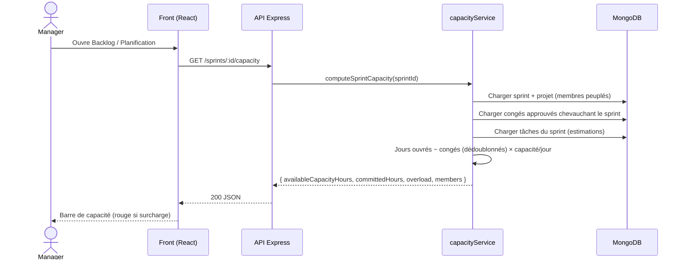
*Figure 2.2 — Diagramme de séquence : calcul de la capacité d'un sprint.*

## 2.5 Règles métier et invariants

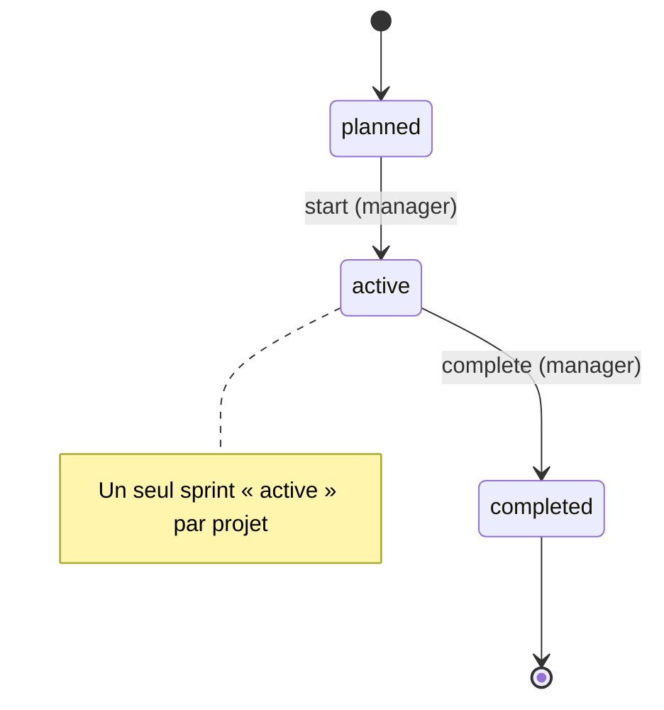
*Figure 2.3 — Cycle de vie d'un sprint.*

Les invariants suivants doivent être préservés :

- **Unité = heures partout** : `task.estimate` et `user.dailyCapacityHours` sont en heures.
- **Backlog** : une tâche dont `sprint` vaut `null` est dans le backlog ; elle ne peut être
  rattachée qu'à un sprint **de son propre projet**.
- **Cycle de vie du sprint** : `planned → active → completed`, **un seul actif** par projet.
- **Capacité** : seuls les congés **`approved`** réduisent la capacité ; un congé `pending` n'a pas
  d'effet.
- **Permissions** : création/gestion des projets et sprints réservées aux rôles habilités ; un
  developer ne modifie que ses tâches assignées ou celles de ses projets.

---

# Chapitre 3 — Conception

## 3.1 Architecture générale

Cadence suit une architecture **3 tiers** : un client React (présentation), une API REST Express
(logique applicative) et une base MongoDB (persistance). Une couche temps réel (Socket.io) propage
les changements vers les clients connectés.

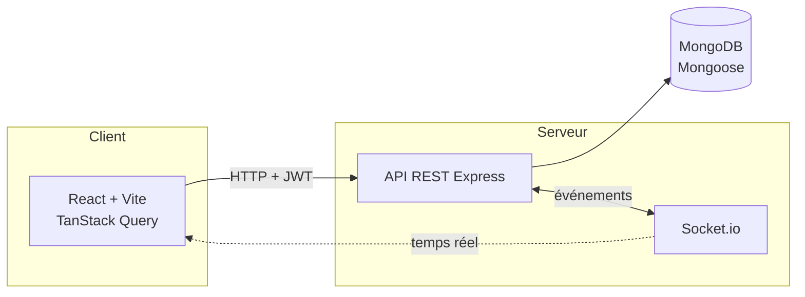
*Figure 3.1 — Architecture générale (3 tiers).*

Le traitement d'une requête suit un **pipeline** clair, du point d'entrée au service métier :

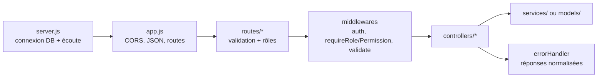
*Figure 3.2 — Pipeline de traitement d'une requête.*

## 3.2 Choix techniques justifiés

| Besoin | Technologie | Justification |
|---|---|---|
| Modèle de données souple | **MongoDB + Mongoose** | Documents flexibles (commentaires/étiquettes embarqués), schémas et validation côté ODM. |
| Authentification sans état | **JWT + bcrypt** | Jeton signé portable, pas de session serveur ; mots de passe hachés. |
| Interface réactive | **React + Vite** | Composants réutilisables, démarrage rapide, écosystème riche. |
| Données serveur côté client | **TanStack Query** | Cache, invalidations, pagination, rafraîchissement maîtrisé. |
| Glisser-déposer | **dnd-kit** | Drag-drop accessible et performant pour le Kanban. |
| Graphiques | **Recharts** | Visualisations (avancement, charge par membre) simples à intégrer. |
| Temps réel | **Socket.io** | Synchronisation du tableau et notifications instantanées. |
| Validation des entrées | **express-validator** | Règles déclaratives par route, messages d'erreur cohérents. |

*Tableau 3.1 — Choix techniques (besoin → technologie → justification).*

## 3.3 Modèle de données

Le domaine est modélisé en plusieurs collections. Les éléments **bornés et toujours lus avec leur
parent** (commentaires, étiquettes, pièces jointes, journal de temps d'une tâche) sont **embarqués**;
le reste est **référencé**.

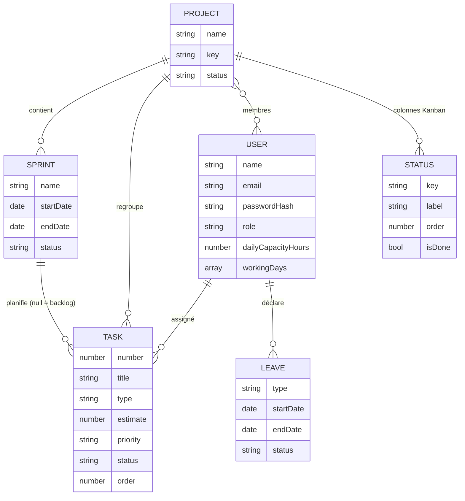
*Figure 3.3 — Modèle de données (vue entité-association simplifiée).*

Outre ces entités, l'application gère des **rôles** (RBAC dynamique), des **notifications** et un
**journal d'activité** (piste d'audit). Des index sont définis sur les accès fréquents, par exemple
sur les tâches : `{ project, sprint, status, order }` et `{ assignee }`.

**Extrait — schéma de la tâche** (les champs sensibles du métier sont commentés) :

```js
const taskSchema = new mongoose.Schema({
  project:  { type: ObjectId, ref: 'Project', required: true },
  number:   { type: Number, default: null },     // affiché « KEY-N » (ex. ATLAS-12)
  sprint:   { type: ObjectId, ref: 'Sprint', default: null }, // null => backlog
  title:    { type: String, required: true, trim: true },
  type:     { type: String, enum: ['feature', 'bug', 'tech'], default: 'feature' },
  estimate: { type: Number, default: 0, min: 0 }, // en HEURES (unité de l'app)
  priority: { type: String, enum: ['low','medium','high','critical'], default: 'medium' },
  status:   { type: String, default: null },      // clé de statut propre au projet
  assignee: { type: ObjectId, ref: 'User', default: null },
  labels:   [String],
  comments: [commentSchema],                      // embarqué
  order:    { type: Number, default: 0 },         // position Kanban (persistance du drag-drop)
}, { timestamps: true });
```

## 3.4 Conception détaillée de la fonctionnalité signature (capacité)

Le calcul de capacité est le **cœur du produit**. Il est isolé dans un service dédié
(`services/capacityService.js`) afin d'être testable indépendamment de la base de données.

**Principe.** Pour un sprint donné, sur sa période `[startDate, endDate]` :

1. **Énumérer les jours** du sprint **en UTC** (pour éviter tout décalage de fuseau horaire).
2. Pour **chaque membre**, déterminer ses **jours ouvrés** (ceux dont le numéro de jour de semaine
   appartient à `workingDays`).
3. Retrancher les **jours couverts par ses congés `approved`** chevauchant le sprint, en les
   **dédoublonnant** via un ensemble de clés `YYYY-MM-DD` (deux congés qui se chevauchent ne
   comptent pas double).
4. `capacité du membre = jours disponibles × dailyCapacityHours`.
5. **Capacité disponible** = somme des capacités des membres ; **charge engagée** = somme des
   `estimate` des tâches du sprint ; **surcharge** si engagé > disponible.

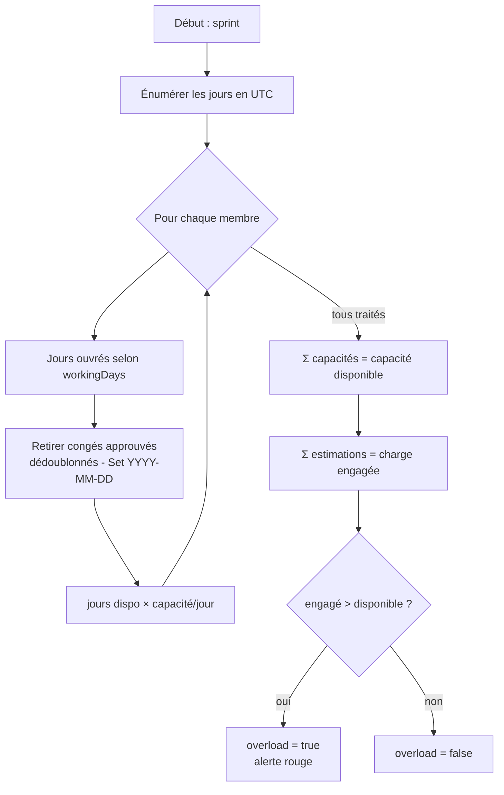
*Figure 3.4 — Logigramme de l'algorithme de capacité.*

La conception expose deux fonctions : `computeCapacityBreakdown(...)` (calcul **pur**, sans accès
base) et `computeSprintCapacity(sprintId)` (chargement des données puis délégation au calcul pur).
Cette séparation rend le cœur arithmétique simple à tester.

## 3.5 Conception de l'interface (IHM)

### 3.5.1 Charte graphique

L'interface vise un rendu **sobre et focalisé**, avec des neutres froids et un seul accent
**cobalt**. La typographie est **Inter**, et les chiffres sont en `tabular-nums` pour un alignement
net.

| Token | Valeur | Usage |
|---|---|---|
| `--bg` | `#F6F7F9` | Fond d'application |
| `--surface` | `#FFFFFF` | Cartes, panneaux |
| `--ink` | `#1A1B1E` | Texte principal |
| `--line` | `#E4E6EA` | Bordures, séparateurs |
| `--accent` | `#2D4ECC` | Cobalt — actions, état actif |

**Couleurs de statut** : À faire (gris), En cours (cobalt), En revue (ambre), Terminé (vert).
**Priorité** : haute (rouge), moyenne (ambre), basse (grise). **Interdits** : dégradés
violet/indigo, glassmorphism, ombres exagérées, effets *glow*, rendu « IA générique ».

> La charte complète, l'arborescence des écrans et les maquettes détaillées (objectif, contenu,
> données, logique applicative et états vide/chargement/erreur de chaque écran) sont consignées dans
> le **brief de design** : `docs/design-brief-cadence.md`.

### 3.5.2 Arborescence des écrans

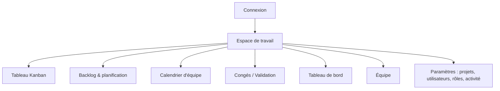

---

# Chapitre 4 — Réalisation et mise en œuvre

## 4.1 Environnement de travail

| Élément | Outil |
|---|---|
| Éditeur | Visual Studio Code |
| Gestion de versions | Git |
| Exécution | Node.js |
| Base de données | MongoDB (local / Atlas) |
| Front | Vite (serveur de dev), navigateur |

Le dépôt réunit le back-end (à la racine : `config/`, `models/`, `controllers/`, `routes/`,
`middlewares/`, `services/`, `seed/`) et le front (`web/`). Les commandes principales sont :

```bash
npm install     # dépendances
npm run dev     # API en développement (nodemon)
npm run seed    # (ré)initialiser la base de démonstration
# dans web/ :
npm run dev     # front React (Vite)
```

## 4.2 Réalisation du back-end

L'API est organisée en couches. Une **gestion d'erreurs centralisée** évite tout renvoi manuel de
statut : les contrôleurs lèvent des erreurs typées (`ApiError.notFound`, `.forbidden`,
`.badRequest`…) et sont enrobés dans `asyncHandler`, qui propage les rejets vers un middleware
unique (`errorHandler`) traduisant aussi les erreurs Mongoose en réponses propres.

La **sécurité** repose sur deux middlewares : `authenticate` (charge `req.user` depuis le JWT) et
`requireRole(...)` / `requirePermission(...)` (RBAC). La **validation** est déclarée par route avec
express-validator, puis appliquée par le middleware `validate` ; les contrôleurs supposent les
entrées déjà validées.

**Extrait — définition des rôles système et du catalogue de permissions** (`config/permissions.js`) :

```js
const SYSTEM_ROLES = [
  { name: 'admin',     label: 'Admin',       permissions: [...PERMISSION_KEYS] }, // toutes
  { name: 'manager',   label: 'Manager',     permissions: ['project.manage','sprint.manage',
      'task.manage.any','leave.review','user.view','activity.view','status.manage'] },
  { name: 'developer', label: 'Développeur', permissions: [] },
];
```

### Principaux points d'accès de l'API

| Méthode | Endpoint | Rôle | Description |
|---|---|---|---|
| POST | `/auth/register` · `/auth/login` | Public | Inscription / connexion (JWT) |
| GET | `/projects/:id/board` | Membre | Tâches du sprint actif par statut |
| POST | `/sprints` · PATCH `/sprints/:id/start` · `/complete` | Manager | Cycle de vie du sprint |
| GET | `/tasks?project=&sprint=` | Membre | Lister (backlog = `sprint` null) |
| PATCH | `/tasks/:id/move` | Membre | Changer statut / sprint / ordre |
| POST | `/leaves` · PATCH `/leaves/:id/approve` · `/reject` | Membre / Manager | Congés |
| GET | `/sprints/:id/capacity` | Manager | **Capacité disponible vs charge engagée** |
| GET | `/dashboard?sprint=` | Manager | Avancement et charge par membre |

*Tableau 4.1 — Principaux points d'accès de l'API.*

## 4.3 Réalisation de la fonctionnalité de capacité

Le cœur de calcul est **pur** (aucun accès base), ce qui le rend testable en isolation. Extrait
représentatif (`services/capacityService.js`), montrant le dédoublonnage des congés et le calcul
des heures disponibles par membre :

```js
const workingDayKeys = new Set();
for (const day of sprintDays) {
  if (workingDays.includes(day.getUTCDay())) workingDayKeys.add(dayKey(day));
}

const offDayKeys = new Set(); // dédoublonne les jours de congé qui se chevauchent
for (const leave of memberLeaves) {
  const overlap = clampRange(toUtcMidnight(leave.startDate), toUtcMidnight(leave.endDate),
                             sprintStart, sprintEnd);
  if (!overlap) continue;
  for (const day of eachDay(overlap.start, overlap.end)) {
    const k = dayKey(day);
    if (workingDayKeys.has(k) && !offDayKeys.has(k)) offDayKeys.add(k);
  }
}

const availableDays  = Math.max(0, workingDayKeys.size - offDayKeys.size);
const availableHours = availableDays * (member.dailyCapacityHours || 0);
```

Puis l'agrégation au niveau du sprint :

```js
const availableCapacityHours = memberDetails.reduce((s, m) => s + m.availableHours, 0);
const committedHours         = tasks.reduce((s, t) => s + (t.estimate || 0), 0);
const overload               = committedHours > availableCapacityHours;
```

Le **`dashboardController` réutilise ce service** pour calculer le taux d'occupation par membre, ce
qui évite toute duplication de la logique de capacité.

**Exemple de surcharge.** Pour un sprint où la somme des disponibilités des membres donne une
capacité de **42 h** et où les tâches planifiées totalisent **44 h** d'estimation, le service
renvoie `overload: true` et `overloadHours: 2`. L'interface affiche alors la barre de capacité en
**rouge** avec le détail des absences ayant réduit la disponibilité.

## 4.4 Réalisation du front

Le front React est organisé par **fonctionnalités** (`web/src/features/*` : board, planning, leaves,
dashboard, team, settings…), avec des **hooks** d'accès aux données fondés sur TanStack Query
(`useTasks`, `useSprints`, `useLeaves`…) et deux contextes (`AuthContext`, `ProjectContext`).

Les appels passent par un **client axios** centralisé (`lib/api.js`) doté d'un **intercepteur JWT** :
le jeton est injecté dans l'en-tête `Authorization`, et une réponse `401` purge le jeton et redirige
vers la connexion. Le **design system** s'appuie sur des composants Radix UI stylés avec Tailwind
(boutons, dialogues, badges, tableaux). Un composant `RealtimeBridge` écoute les événements
Socket.io et invalide les caches concernés, assurant la **synchronisation temps réel** du tableau et
des notifications.

Le tableau Kanban utilise **dnd-kit** pour le glisser-déposer ; à la pose d'une carte, le statut et
l'ordre sont envoyés à `PATCH /tasks/:id/move` et persistés.

## 4.5 Présentation des écrans

Les captures ci-dessous sont issues de l'application réelle, lancée sur le jeu de démonstration
(projet « Atlas Retail », sprint actif « Catalogue & Panier »).

**Écran de connexion.** Accès à l'espace de travail ; l'argumentaire met en avant la promesse
produit (« Planifiez vos sprints selon la capacité réelle de l'équipe »).

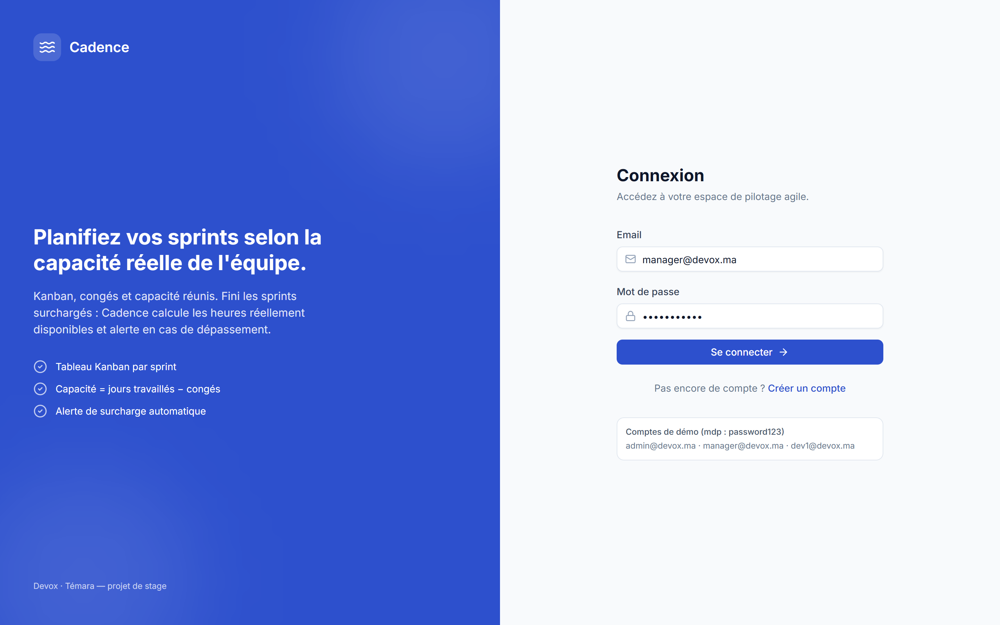
*Figure 4.1 — Écran de connexion.*

**Tableau Kanban.** Quatre colonnes (À faire, En cours, En revue, Terminé) avec compteurs et
indicateur de capacité ; cartes de tâche au format `ATLAS-n` (priorité, assigné, estimation),
glisser-déposer.

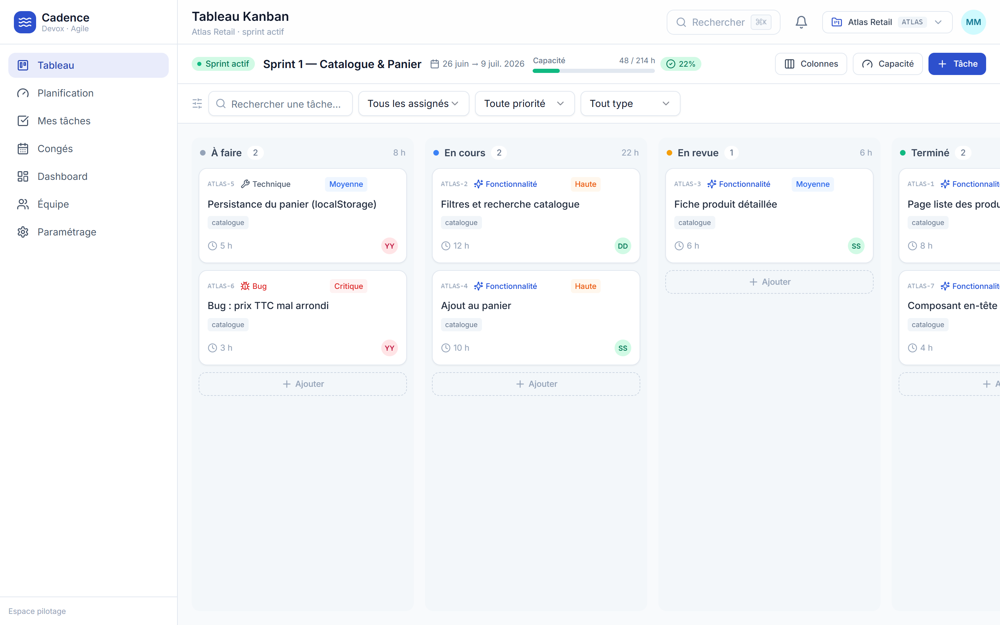
*Figure 4.2 — Tableau Kanban du sprint actif.*

**Backlog & planification.** La barre de capacité compare la **charge engagée** à la **capacité
disponible** (ici « OK », non surchargée) ; le backlog se planifie tâche par tâche, la capacité se
mettant à jour à chaque ajout.

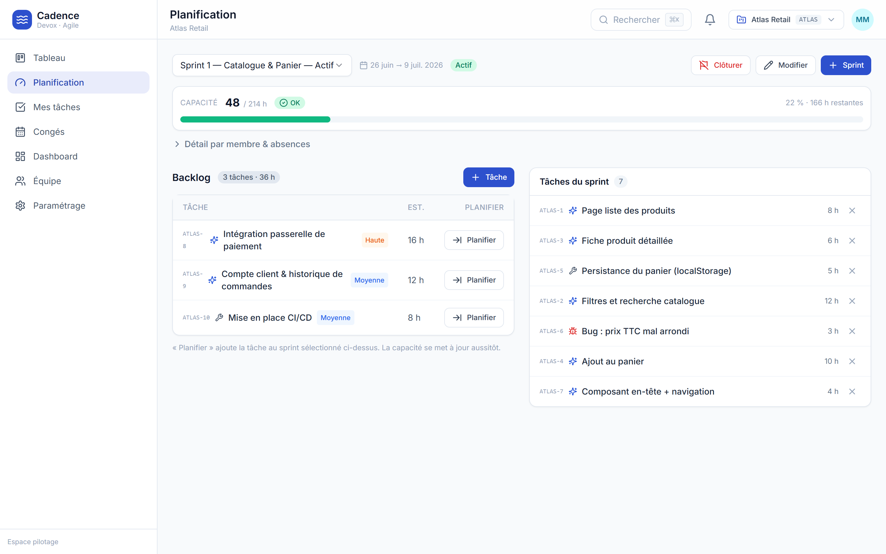
*Figure 4.3 — Planification du sprint et barre de capacité.*

**Congés & calendrier d'équipe.** Calendrier disponibilité (membres × jours, présent/congé/maladie),
file des demandes à valider (approuver/refuser) et liste de tous les congés avec leur statut.

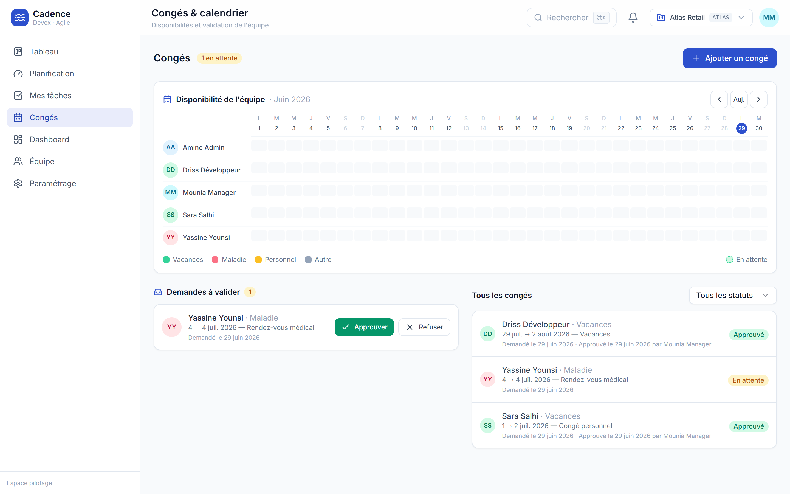
*Figure 4.4 — Congés et calendrier d'équipe (disponibilité + validation).*

**Tableau de bord.** Indicateurs d'avancement (taux, tâches terminées, reste à faire, occupation),
répartition des tâches par statut, charge par membre (estimé vs disponible) et barre de capacité du
sprint.

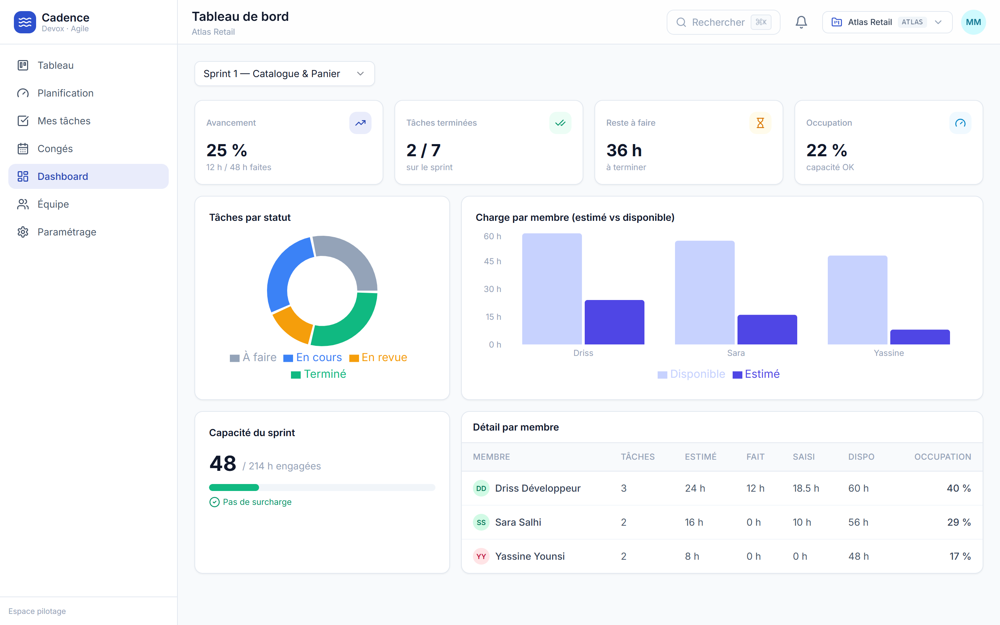
*Figure 4.5 — Tableau de bord du sprint.*

**Équipe du projet.** Membres affectés, rôle sur le projet, capacité hebdomadaire et temps
réellement saisi (suivi du temps).

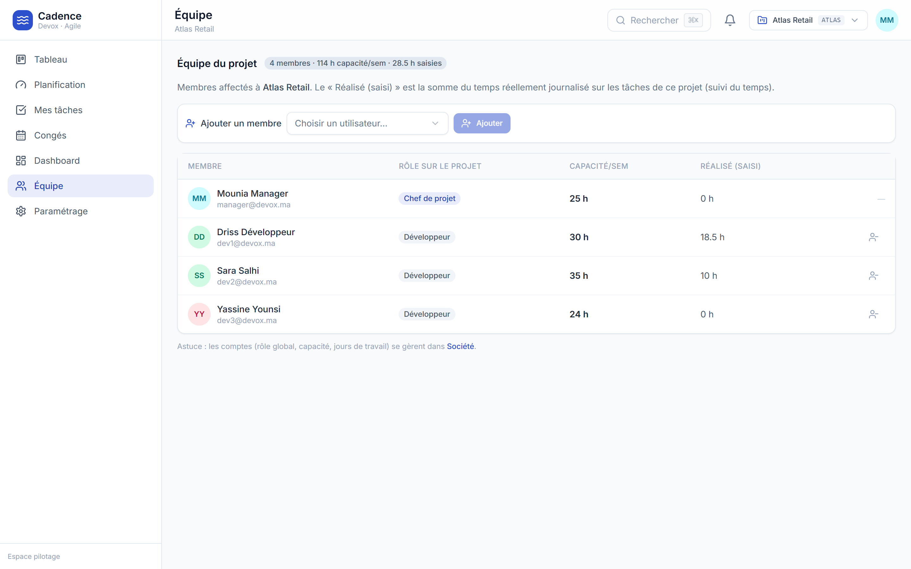
*Figure 4.6 — Équipe du projet : capacité et temps réalisé.*

## 4.6 Données de démonstration

Un script de *seed* (`seed/seed.js`) initialise une base cohérente pour la démonstration et les
tests :

- **Projet** : « Atlas Retail » (clé `ATLAS`).
- **Comptes** : un admin, un manager et trois développeurs (capacités quotidiennes et jours
  travaillés variables — dont un développeur à 4 jours/semaine).
- **Sprints** : un sprint **actif** (« Catalogue & Panier ») et un sprint **planifié** (« Paiement »).
- **Tâches** : plusieurs tâches réparties sur les colonnes Kanban (avec estimations et journal de
  temps) plus quelques tâches au backlog.
- **Congés** : des congés **approuvés** chevauchant le sprint actif (qui réduisent la capacité) et
  un congé **en attente** (sans effet), afin d'illustrer concrètement le calcul.

Les comptes de démonstration partagent le mot de passe `password123` ; la connexion s'effectue via
`POST /auth/login`.

## 4.7 Tests et validation

- **Tests automatisés** : le service de capacité est couvert par des tests Jest
  (`services/__tests__/capacityService.test.js`), portant sur le dédoublonnage des congés, la
  gestion des jours ouvrés et la détection de surcharge.
- **Vérification manuelle** : les parcours principaux (connexion, déplacement de tâches,
  déclaration/validation de congé, planification d'un sprint) ont été testés sur le jeu de *seed*.
- **Contrôle des permissions** : vérification que les actions réservées (validation de congé,
  gestion de sprint, administration) ne sont accessibles qu'aux rôles habilités.

---

# Conclusion générale et perspectives

## Bilan

Le stage a permis de concevoir et réaliser **Cadence**, une application web de pilotage de projets
agiles fonctionnelle de bout en bout : une API REST sécurisée (Express/MongoDB) et un front React
couvrant l'ensemble des écrans (Kanban, backlog/planification, calendrier, congés, tableau de bord).
La **fonctionnalité signature** — la dérivation de la capacité d'un sprint à partir de la
disponibilité réelle de l'équipe, avec alerte de surcharge — est opérationnelle et testée, et elle
constitue la véritable valeur ajoutée du produit par rapport aux outils existants.

Les objectifs fixés au début du stage ont été atteints, et la réalisation va au-delà du périmètre
minimal initial (RBAC dynamique, notifications, journal d'activité, suivi du temps, synchronisation
temps réel).

## Compétences acquises

- **Techniques** : conception d'API REST, modélisation de données (MongoDB/Mongoose),
  authentification et autorisation (JWT, RBAC), développement front React (TanStack Query, dnd-kit,
  Recharts), tests automatisés, temps réel (Socket.io).
- **Transversales** : analyse d'un besoin métier, démarche agile, gestion de versions, autonomie,
  rigueur dans la traduction de règles métier en code, communication avec l'encadrant.

## Perspectives

- **Application mobile** (React Native / Expo) consommant la même API.
- **Affinage des estimations** : option de story points en complément des heures.
- **Exports et reporting** (PDF/CSV) des sprints et de la capacité.
- **Intégration continue** (CI/CD) et déploiement automatisé.
- **Notifications par e-mail** en complément du temps réel.

---

# Bibliographie / Webographie

1. **React** — Documentation officielle. https://react.dev
2. **Vite** — Documentation officielle. https://vitejs.dev
3. **Node.js** — Documentation officielle. https://nodejs.org
4. **Express** — Guide officiel. https://expressjs.com
5. **MongoDB** — Manuel. https://www.mongodb.com/docs
6. **Mongoose** — Documentation. https://mongoosejs.com
7. **JSON Web Tokens (JWT)**. https://jwt.io
8. **TanStack Query**. https://tanstack.com/query
9. **dnd-kit**. https://dndkit.com
10. **Recharts**. https://recharts.org
11. K. Schwaber, J. Sutherland — *The Scrum Guide*. https://scrumguides.org
12. _[Ajouter les références imposées par l'établissement / cours de gestion de projet.]_

---

# Annexes

## Annexe A — Algorithme de capacité (fonction principale)

Voir `services/capacityService.js`. La fonction `computeCapacityBreakdown({ sprint, members,
leaves, tasks })` réalise le calcul pur ; `computeSprintCapacity(sprintId)` charge les données puis
y délègue. Réponse type :

```json
{
  "availableCapacityHours": 42,
  "committedHours": 44,
  "overload": true,
  "overloadHours": 2,
  "utilizationRate": 105,
  "members": [
    { "user": { "name": "…" }, "workingDays": 9, "leaveDays": 2, "availableDays": 7,
      "availableHours": 49, "absences": [ { "type": "vacation", "workingDaysOff": 2 } ] }
  ]
}
```

## Annexe B — Table des endpoints de l'API

_(Voir Tableau 4.1 ; liste complète dans `routes/` et `.claude/skills/cadence-project/references/api.md`.)_

## Annexe C — Modèle de configuration `.env.example`

```
PORT=4000
MONGODB_URI=mongodb://127.0.0.1:27017/cadence
JWT_SECRET=change-me-in-production
JWT_EXPIRES_IN=7d
CORS_ORIGIN=*
```

## Annexe D — Captures d'écran supplémentaires

_[Espace réservé pour des captures complémentaires : détail d'une tâche, gestion des rôles,
journal d'activité, etc.]_
